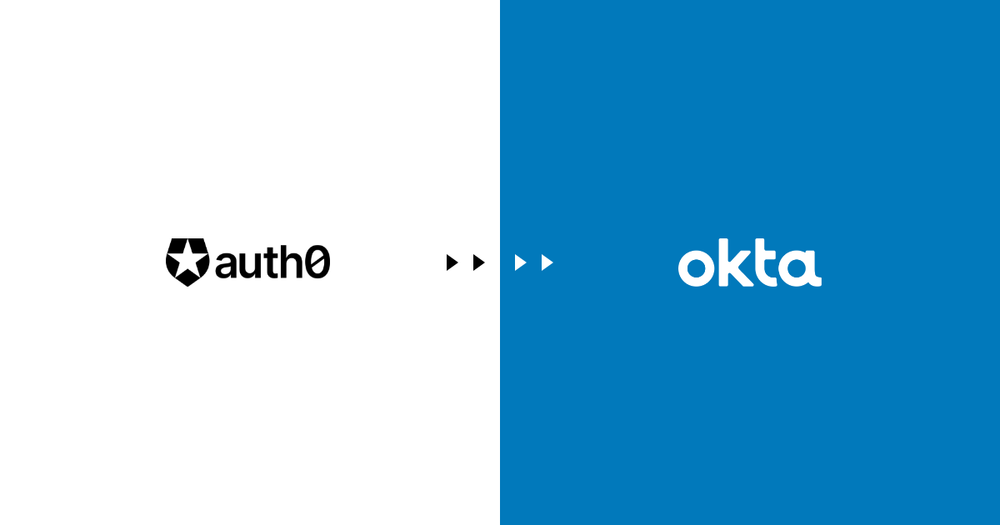
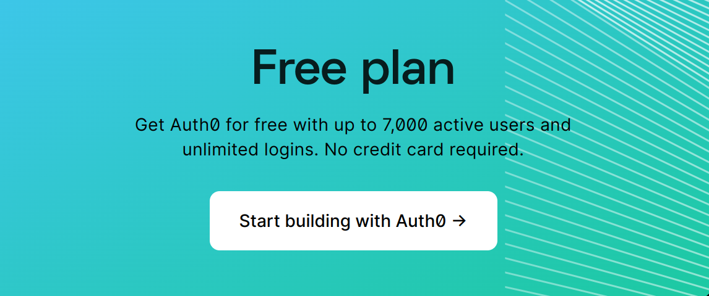
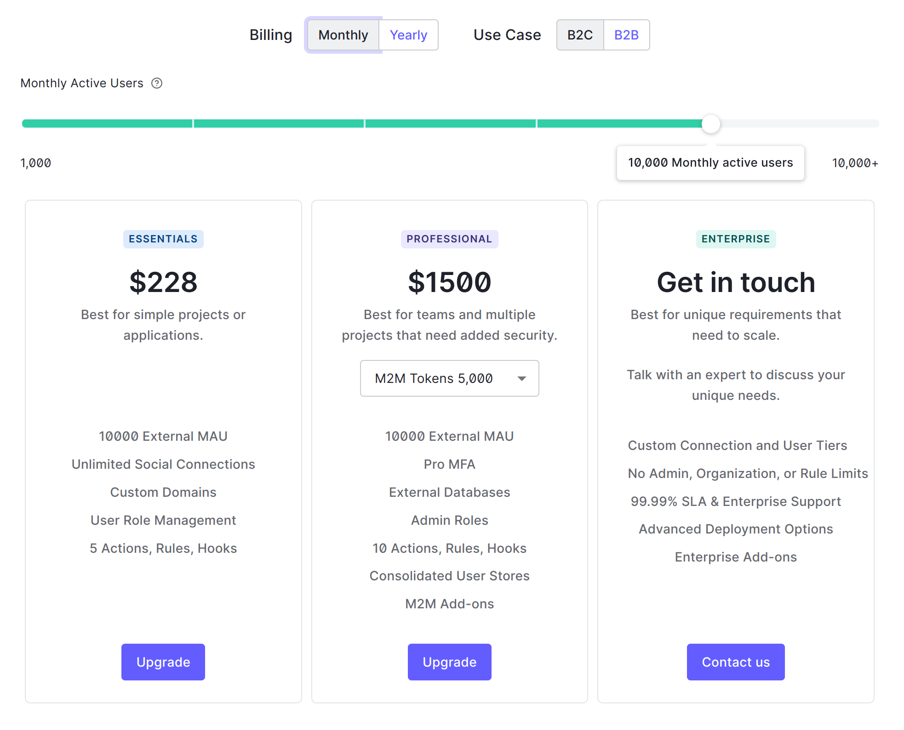

Need authentication but not sure who to go with? Read on for an in-depth comparison of the leading authentication providers.

## Table Of Contents:
- [Introduction](#introduction)
- [Auth0 and Okta](#auth0-vs-okta)
- [Amazon Cognito](#cognito)
- [SuperTokens](#supertokens)
- [Conclusion](#conclusion)

## <a name="introduction" href="">Introduction</a>
Solutions that authenticate and manage users’ access to a system have never been more important.

In today's post, we will be looking at some of the leading Authentication providers, breaking down their features and pricing so you can decide if they fit your requirements.

## <a name="auth0-vs-okta" href=""> Auth0 vs Okta</a>

### Auth0

Auth0 is an authentication and authorization software as a service platform. It started in 2013 as an identity management service to allow developers to easily connect their apps to enterprise and social providers.

Over the years they have scaled their services, achieved compliance certifications, and added more features. Today they are one of the leading Auth providers in the space.

### Okta
Okta is another leader in the authentication and authorization space, but, with a focus on workforce identity and integration with other enterprise services.

On May 3, 2021, Okta announced they had acquired Auth0 for $6.5B. This brought a lot of attention to Auth0. Okta is notorious for being a sales-focused company and many speculate that this practice will trickle down to Auth0. You can learn more about what that means for the market [here](https://supertokens.com/blog/the-real-reason-okta-spent-on-auth0).

### So what is the difference between Auth0 and Okta?

As mentioned previously Okta’s main focus is workforce identity. Although they do offer customer identity solutions, pricing for these plans is billed annually and it can be [extremely expensive](https://www.okta.com/pricing/#customer-identity-pricing). After the Auth0 acquisition, Okta now encourages developers who are looking for more affordable auth solutions to use Auth0

### Advantages of using Auth0

#### Simple Setup: 
- Setting up authentication in your app with Auth0 is simple. The docs are well written, accessible, and also provide demo apps.

#### SDK and Integration support: 
- They support over [60 SDKs](https://auth0.com/docs/libraries) and [50 integrations](https://auth0.com/docs/customize/integrations), meaning if you have a use case, Auth0 will probably have an SDK to support that framework and integration to support that service. 

#### Feature set: 
- Auth0's wide breadth of features is one of its largest selling points. Whether you are an indie developer looking for email-password login for your side project or a massive enterprise that requires enterprise connections and MFA Auth0 will have you covered. 

### Disadvantages of using Auth0

 #### Expensive
- One of the biggest reasons people switch away from Auth0 is how expensive their pricing can get. To give some context Auth0’s free plan allows for up to **7000 MAUs** and up to two social connections. This is fine for small projects but as your business starts to scale, Auth0’s pricing starts to scale much faster. For example, if you have around **7000 MAUs** and have enterprise connections enabled you can expect to pay around **$1800/month**.
- If you need to migrate your users, you would need to have an enterprise plan to export your user's password hashes.

#### Opaque Pricing:
- After **10000 MAUs**, Auth0’s pricing for plans becomes completely custom. This makes it hard for developers who are evaluating Auth0 to know how much they would have to pay once their product scales past the boundaries of the base plans.

#### Extensibility:
- Auth0's rules, hooks, and actions all provide ways for extending and customizing Auth0s service but you are limited by the number of flows they allow you to customize.
- Auth0’s extensibility options don't allow you to change the logic of a flow.
- To use this feature you have to add your code to their dashboard. This makes maintaining the code a hassle.

## Auth0 Pricing:

#### Free Plan
Auth0’s free plan allows having up to **7000 MAUs** and up to 2 social connections and 3 Actions, Rules, and hooks. 

#### Paid Plans
Auth0 splits its paid plans into two sections based on your use case, with each use case having a free, professional, and enterprise tier. In both cases, the enterprise tier has fully custom pricing and you need to talk to their support team.

**Use Case 1:  Business to Consumer**
- The essential plan allows for up to **10,000 MAUs**, unlimited social login, custom domains, and user role management.
- The professional plan adds multifactor authentication, the ability to connect your own database, and additional action, rules, and hooks

**Use Case 2: Business to Business**
- The essential plan offers enterprise connections, multi-factor authentication, user role management, and organisations. 
- The professional plan allows you to connect your own database and increases the number of organisations and the actions, hooks, and roles.

### So is Auth0 the way to go?
Auth0 has all the functionality you need and is easy to set up and integrate with, but their pricing doesn't scale well and it can become very expensive as your userbase grows and you require more features.

### Auth0 Alternatives
Auth0 is one of the biggest competitors in the space, but, it's high price tag has resulted in a demand for alternatives. In this post we are going to be looking at: 
- [Amazon Cognito](#cognito) 
- [SuperTokens](#supertokens)

## <a name="cognito" href=""> Amazon Cognito</a>

Cognito is a service that provides authentication, authorization, and user management for web and mobile apps. It is part of the AWS suite of products and can be used easily with any of their other offerings such as Lambda.

Cognito supports multiple compliance programs and can scale to millions of users. It has grown in popularity due to its accessible pricing.

### Advantages of using Cognito

#### Pricing:
- One reason why so many people use Cognito is its price. It offers its basic authentication flow for free for the first **50000 MAUs** and it is $0.0055 per MAU after that.
#### Integration with other AWS services:
- Cognito’s tight integration with other AWS services such as API Gateway, AppSync, and ALB removes a whole layer of custom code you’d have to write if you use AWS's services.

### Disadvantages of using Cognito

#### Developer Experience:
- Cognito's documentation can vary in quality with some features not being documented at all. This can make working with the product very confusing and frustrating.
- Cognito is also not just a user management system but a single service with 3 distinct features. These are User Pools, Identity Pools, and Sync. This can be very confusing for newcomers.
- There have also been complaints about Cognito being slow to respond to bugs and feedback. For example [this issue](https://github.com/aws-amplify/amplify-js/issues/987) was breaking the flow for many users and was open for 4 years before it was resolved with the help of a community member.

#### Features:
- Cognito's core feature set is limited and it relies on other services in AWS’s stack to make up for this gap. This results in the user having to deal with AWS services when they require more advanced features.
#### UI Customization:
- Cognito’s built-in UI offers basic branding and colour customization through their dashboard. If you need a more custom design you will need to create your own UI.
#### Migration:
- Cognito does not allow you to export user password hashes. This can make migration to another database or service much harder.

## AWS Cognito Pricing
Cognito’s free tier offers up to **50,000 MAUs** for free. Included are the Identity pool features which cover access control and RBAC. 

#### Free:
- User pools free for up to **50000 MAUs**
- **50 MAUs** for SAML / OIDC
- identity pools (Access control, RBAC, etc)

#### Paid Features:
Cognito offers pricing tiers for additional MAUs and users with SAML/OIDC connections. They also offer advanced security features like compromised credential protection, risk-based adaptive authentication, and monitoring.
- Pricing tiers for additional MAUs:

- Additional SAML/OIDC users:
  - **$0.015** per MAU after the first **50** in the free tier
- Pricing tiers for advanced security features : 

- SMS charges for multi-factor: 
  - Inbound charges:
  
  - Outbound charges:
  

### So is Cognito the way to go?
Cognito's free tier and integration with other AWS services position it as a great auth provider, but it does not provide the best developer experience. Users have complained about the documentation being confusing at times, making it hard to integrate with.

## <a name="supertokens" href="">SuperTokens</a>

SuperTokens is an open-source authentication solution that provides a managed service for hassle-free auth and an on-prem solution so developers can manage their data. 

Starting as a session management solution in 2019, SuperTokens has evolved into a complete auth solution providing email-password, social and passwordless login with extensive customization options to curate the login experience to your needs.

SuperTokens differentiates itself from its competitors with its flexibility. If you don't want to deal with handling user data you can use the managed service or, you can self-host the solution for free and control 100% of the data with your database. There are also no restrictions on completely customising the auth flow with their **override** feature. 

### Advantages of using SuperTokens:
#### Completely Open Source:
- All of SuperTokens SDKs including the core service are open source. This allows developers to poke around the code for vulnerabilities and contribute to features.
#### Simple Setup:
- SuperTokens modular architecture makes the setup simple. It allows the developer to pick and choose what functionality they want and only see documentation relevant to their use case.
- Pre-built Auth UI that can be embedded in your website natively
- Support over [Discord](https://supertokens.com/discord).
####  Flexibility: 
- As mentioned previously Supertokens has a managed service with reasonable pricing as well as a completely free self-hosted version.
- SuperTokens provides an override feature that enables you to fully customise authentication flows on both your frontend and backend. SuperTokens also provides pre-built UI components that can be rendered directly on your frontend

###  Disadvantages of using SuperTokens:
#### Enterprise features:
- At the time of writing this post SuperTokens doesn't offer some enterprise features like SCIM provisioning, admin and organization support.

#### Tech Stack Support
- As of writing this article supertokens supports `Nodejs`, `Golang` and `Python` on the backend with `Reactjs(All Features)`, `VanillaJS(only session management)` and `React Native(only session management)` on the frontend. They currently do not support many popular languages like `Java` and `Php` and they do not have pre-built UI for popular frontend frameworks like `Angular` and `Vue`. 

## SuperTokens Pricing:
At the time of writing this article, the SuperTokens feature set is completely free. If you decide to use the self-hosted version you can download the core and use it for free for an unlimited amount of users. 

- #### Self-Hosted:
  - Free forever for unlimited users.

- #### Managed Service:
  - Free for the first **5000 MAUs** .
  - **$29/month** for every **5000 MAUs** beyond the free limit of up to **50000 MAUs**.
  - Custom pricing beyond **50000 MAUs**

### So is SuperTokens the way to go?
SuperToken's feature set and pricing make it a great choice for startups and mid-level businesses, but it may not be the best fit for large organisations that require enterprise features.

## <a name="conclusion" href="" >Conclusion </a>
So what authentication provider do you go with?
Well in the end it depends on your use case.

- If your costs can scale with Auth0’s pricing and you don't need to customise their flows too much, then Auth0 is the way to go. 
- AWS Cognito’s generous free tier and tight integration with other AWS services make it a great option if you can deal with sub-par documentation and support.
- If you are a startup or mid-level organisation looking for an open-source solution that can grow with your organisation, with extensive customization options and the ability to self-host or use a managed service, SuperTokens is the clear choice. 

|  | SuperTokens | Auth0 | AWS Cognito |
|:---:|:---:|:---:|:---:|
| Pricing | $$ / Free | $$$$ | $$$ |
| User Satisfaction | High | Medium | Low |
| UI and backend customisability | High | Medium | Low |
| Size of the company offering services | Startup | Enterprise | Enterprise |
| Company provided support for free tiers | High | Low | Low  |
| Self Hostable | Yes | Yes | No |
| Open Source | Yes | No | No |
| Managed Service | Yes | Yes | Yes |
| Supported Cloud Providers | All | All | AWS |
| Compliance (SOC2, GDPR... | In Progress  (not required for self hosted) | Yes | Yes | Self hosted -  so not required 
| User management dashboard | No | Yes | Yes | 
| Passwordless login (email + phone no) | Yes | Yes | Yes |
| Social and Email Password login | Yes | Yes | Yes |
| Custom Open ID connector | Yes | Yes (Enterprise Tier) | Yes |
| SAML Login | Yes | Yes (Essential Tier) | Yes |
| Being an OAuth 2.0 provider | No | Yes | Yes |
| External Database | No | Yes (Essential Tier) | No |
| SLA gaurantees | Yes | Yes | Yes |
| Single sign on | Partial | Yes | Yes |
| 2FA | Partial | Yes | Yes | Yes |
| External Database | No | Yes (Essential Tier) | No |
| Roles and permissions | Yes | Yes | Yes |
| Web3 login | No | Yes | No |
| Machine to machine | Partial (only using JWT) | Yes | Yes |
| Multi tenancy | Partial | Yes | Yes |
| Cookie based session management (Out of the box) | Yes | No | No |
| Customise Emails and SMS | Yes | Yes | Yes |

Find the full comparsion chart on our [pricing page](https://supertokens.com/pricing)