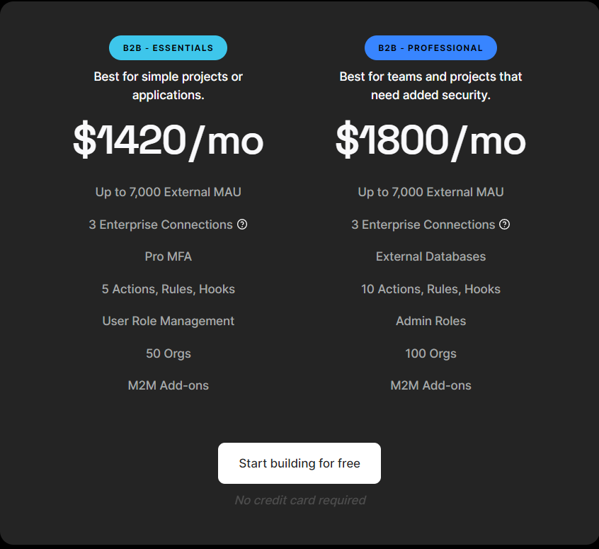
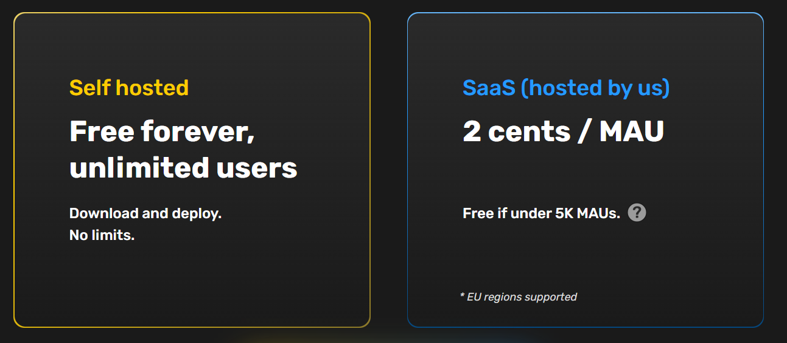

## Table of Contents
- [What is Auth0?](#what-is-auth0)
- [Auth0 Pricing](#auth0-pricing)
- [Auth0 Alternative: SuperTokens](#auth0-alternative-supertokens)

## What is Auth0?

Auth0 is an authentication and authorization provider. It started in 2013 as an identity and access management (IAM) service to allow developers to connect their apps to enterprise and social providers easily.

Over the years, they have scaled their services, achieved compliance certifications, and added more features.  

## Auth0 Pricing

Auth0’s offerings can be broadly broken down into their free and paid plans.

### Free Plan

- Auth0’s free plan allows having up to 7000 MAUs and up to 2 social connections and 3 Actions. Actions are functional services that fire during specific events across multiple identity flows
- This tier is ideal for testing out Auth0 or for personal projects. However, features such as social connections, user roles, and custom domains are unavailable. Teams are forced to move to paid plans for more serious projects.

### Paid Plans
Auth0 splits its paid plans into two sections based on whether your app is “B2C” or “B2B”. Each use case has it's own Essential, Professional, and Enterprise tiers. In both cases, the Enterprise tier has fully custom pricing.

**Use Case 1: Business to Consumer**
> Note: Both the Essential and Professional tiers allow for up to 10,000 monthly active users. If you cross these thresholds, you will be asked to move to the Enterprise tier.

- **Essential**:
  - The essential plan allows for unlimited social connections, custom domains, and user role management. You also get 2 more Actions.
  - Pricing starts at $23/month for 1,000 monthly active users and scales to $228/month for 10,000 users.

- **Professional:** 
  - The professional plan adds features such as multifactor authentication, admin roles, the ability to connect an external database, and up to 10 Actions.
  - Pricing starts at $240/month for 1,000 monthly active users and scales to $1,500/month

- **Enterprise:**
  - The Enterprise plan has a 99.99% SLA with enterprise support and advanced cloud deployment options. This tier also allows private deployments.
  - Enterprise pricing is completely custom and requires you to speak to an Auth0 sales representative. From our research, enterprise plans start at $30,000 / year ($2,500 / month) but scale to 6 and 7 figures as well.

**Use Case 2: Business to Business**
Similar to the first use case, the B2B plan also has essential, professional, and enterprise tiers. 

> Note: Both the Essential and Professional tiers allow for up to 7,000 monthly active users. If you cross these thresholds you will be asked to move to the Enterprise tier.

- **Essential:**
  - The essential plan offers enterprise connections, multi-factor authentication, user role management, and organization management.
  - Pricing starts at $130/month for 500 monthly active users and scales to $1,420/month for 7,000 users.
- **Professional:**
  - The professional plan allows you to connect your database and increases the number of organizations as well as Actions count.
  - Pricing starts at $800/month for 500 monthly active users and scales to $1,800/month for 7,000 users.
- **Enterprise:**
  - The Enterprise plan has 99.99% SLA with enterprise support and advanced cloud deployment options. This tier also allows private deployments.
  - It removes restrictions on the number of Monthly Active Users.
  - Enterprise pricing is completely custom and requires you to speak to an Auth0 sales representative.  From our research, it seems enterprise plans start at $30,000 / year ($2,500 / month) but scales to 6 and 7 figures as well

**Should you use Auth0?**
- Integrating with Auth0 is easy. They support numerous frameworks and have dedicated guides explaining their features, but, their pricing does not scale well.
- Since the Okta acquisition, Auth0 has restructured its features and pricing, forcing some users into the enterprise tier. This could result in some customers paying up to 4 times more for features they do not need. 
- Enterprise pricing is also non-existent on their website. Users are required to get on a sales call to discuss pricing in this tier. This increases the difficulty of evaluating Auth0 for your company.
- Auth0 does offer a plan for [startups](https://auth0.com/startups). For a year, they will provide the entire platform for free but will revert to the default pricing model once the startup plan expires.

## Auth0 Alternative: SuperTokens

### What is SuperTokens?
SuperTokens is an open-source authentication solution that provides a managed service for hassle-free auth and an on-prem solution so companies can easily manage their data.

### SuperTokens Pricing:
At the time of writing this article, the core SuperTokens feature set is completely free. If you decide to use the self-hosted version, you can download the core and set up authentication for free for an unlimited number of users.

- **Self-Hosted:**
  - Free forever for unlimited users.
- **Managed Service:**
  - Free for the first 5000 MAUs.
  - 2 cents / MAU post the first 5000 MAUs.

### Should you use SuperTokens?
SuperToken’s feature set and pricing make it an excellent choice for startups and mid-level businesses, but it may not be the best fit for large organizations that require enterprise features.
