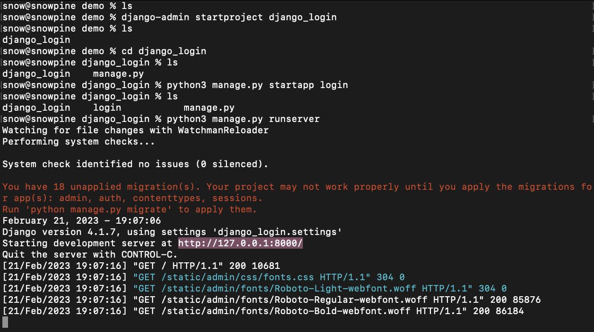
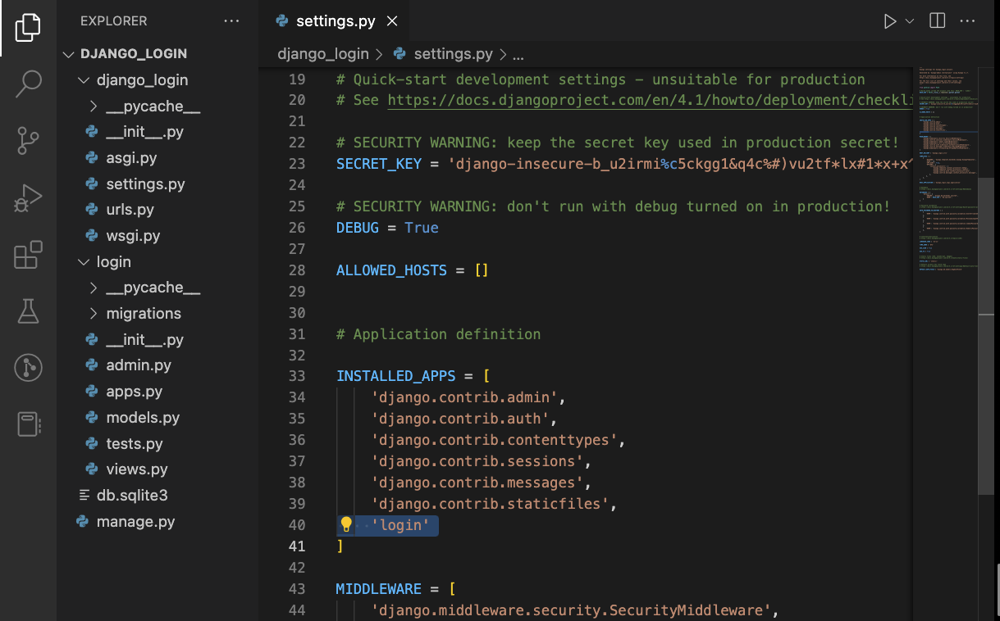
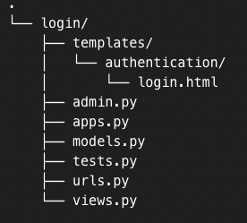

### High Level Refresher

**Django** is a high-level Python framework that follows the model-template-views architectural pattern. Django is one of the most [popular web frameworks](https://www.jetbrains.com/lp/devecosystem-2022/python/) due to its security, scalability, and flexible design. Companies like Instagram, Reddit, and Dropbox all used Django. 

**Bootstrap** is an open-source CSS framework that provides pre-built HTML, CSS, and JavaScript components. This includes elements such as navigation bars, forms, buttons, modals, and more. Originally created by Twitter, Bootstrap is now maintained by a large developer community.

### Prerequisites

- A basic understanding of HTML, CSS, and Javascript
- A basic understanding of Django
- [Python3](https://www.python.org/downloads/) installed on your machine
- [Django](https://docs.djangoproject.com/en/4.1/topics/install/) installed on your machine

### Setting up a Django application

Let’s first create a project. In your command line, find the correct directory, and run the following command: 

```jsx
$ django-admin startproject django_login
```

This creates the project we’ll be working in. From there, we’ll need to create an application. Since we’re building a login screen, navigate into the project with `cd django_login`, and run the following command: 

```jsx
$ python3 manage.py startapp login
```

Let’s now run the server to test if everything has been set up correctly. Run the following command: 

```jsx
$ python3 manage.py runserver
```

By deploying our Django application, we can check in real-time if the build is compiling correctly. Since we have only initialized our Django application, in [localhost:8000/](http://localhost:8000/), you should see the following webpage:


Below is a command-line screenshot of setting up a Django application from scratch. 



### Editing Project Configs

**django_login/settings.py**

First, we’ll notify our project that we’ve created an application. To do this, go into the `django_login` folder and find the `settings.py` file. Scroll down to the `INSTALLED_APPS` section and add `'login'` (our application name) to the list of applications.



**django_login/urls.py**

From there, we’ll need to edit the `urls.py` file to account for our new application. We will be using the [built-in `LoginView`](https://docs.djangoproject.com/en/4.1/topics/auth/default/) from Django which will display the login form and process the login action. 

Replace the template code with the following:

```python
from django.contrib import admin
from django.urls import path, include
from django.contrib.auth.views import LoginView

urlpatterns = [
    path('', LoginView.as_view()),
    path('login/', include('login.urls')),
    path('admin/', admin.site.urls),
]
```

### Building the login screen with Bootstrap

**login/templates/registration/login.html**

First, within the `login` folder, we’ll need to create a `templates` folder, and then a `registration` folder within. From there, we’ll create a `login.html` file.

Because we’re using the built-in `LoginView` of Django, we must provide the HTML template with the `registration/login.html` format. 

Inside `login.html`, we’ll add the following Bootstrap code (delivered via CDN for convenience, though there are [other Bootstrap installation methods](https://getbootstrap.com/docs/5.3/getting-started/download/)):

```html
<!DOCTYPE html>
<html lang="en">
  <head>
    <meta charset="utf-8">
    <meta http-equiv="X-UA-Compatible" content="IE=edge">
    <meta name="viewport" content="width=device-width, initial-scale=1">
    <title>Signin</title>
    <link href="https://cdn.jsdelivr.net/npm/bootstrap@5.3.0-alpha1/dist/css/bootstrap.min.css" rel="stylesheet" integrity="sha384-GLhlTQ8iRABdZLl6O3oVMWSktQOp6b7In1Zl3/Jr59b6EGGoI1aFkw7cmDA6j6gD" crossorigin="anonymous">    
    <script src="https://cdn.jsdelivr.net/npm/bootstrap@5.3.0-alpha1/dist/js/bootstrap.bundle.min.js" integrity="sha384-w76AqPfDkMBDXo30jS1Sgez6pr3x5MlQ1ZAGC+nuZB+EYdgRZgiwxhTBTkF7CXvN" crossorigin="anonymous"></script>
    
  </head>
  <body class="text-center">
    <form class="form-signin">
      <h1 class="h3 mb-3 font-weight-normal">Django Login Demo</h1>
      
      <input id="inputEmail" class="form-control" placeholder="Email address" required="" autofocus="" type="email">
      <input id="inputPassword" class="form-control" placeholder="Password" required="" type="password">
      <div class="checkbox mb-3">
        <label>
          <input value="remember-me" type="checkbox"> Remember me
        </label>
      </div>
      <button class="btn btn-lg btn-primary btn-block" type="submit">Sign in</button>
    </form>
  </body>
</html>

<style>
html,
body {
  height: 100%;
}

body {
  display: -ms-flexbox;
  display: -webkit-box;
  display: flex;
  -ms-flex-align: center;
  -ms-flex-pack: center;
  -webkit-box-align: center;
  align-items: center;
  -webkit-box-pack: center;
  justify-content: center;
  padding-top: 40px;
  padding-bottom: 40px;
  background-color: #f5f5f5;
}

.form-signin {
  width: 100%;
  max-width: 330px;
  padding: 15px;
  margin: 0 auto;
}

.form-signin .checkbox {
  font-weight: 400;
}

.form-signin .form-control {
  position: relative;
  box-sizing: border-box;
  height: auto;
  padding: 10px;
  font-size: 16px;
}

.form-signin .form-control:focus {
  z-index: 2;
}

.form-signin input[type="email"] {
  margin-bottom: -1px;
  border-bottom-right-radius: 0;
  border-bottom-left-radius: 0;
}

.form-signin input[type="password"] {
  margin-bottom: 10px;
  border-top-left-radius: 0;
  border-top-right-radius: 0;
}
</style>
```

**login/views.py**

Now that we have our HTML, we need to render it in Django. Go to the `views.py` file and replace the template code with the following:

```python
from django.shortcuts import render

def index(request):
    return render(request, 'authentication/login.html')
```

### Running the application

Once everything is set up, your `login` folder structure should look like this:



When we run python `manage.py runserver`, the following webpage should show up on your localhost.


Great success!

### Conclusion

Congrats - you’ve created a login screen using Django with Bootstrap! You’ll still need to set up the authentication logic (hashing & storing the user credentials, session management, building the signup and forgot password screens, and redirecting post-login).

But for now - time to celebrate!

At SuperTokens, we simplify your authentication process - and help you set up a fully functioning [Django authentication flow](https://github.com/supertokens/supertokens-python/tree/master/examples/with-django/with-thirdpartyemailpassword) within minutes. Check us [out](https://supertokens.com) or message us on [Discord](https://supertokens.com/discord)!