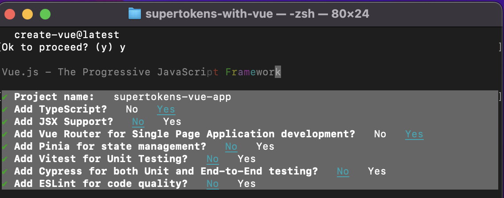
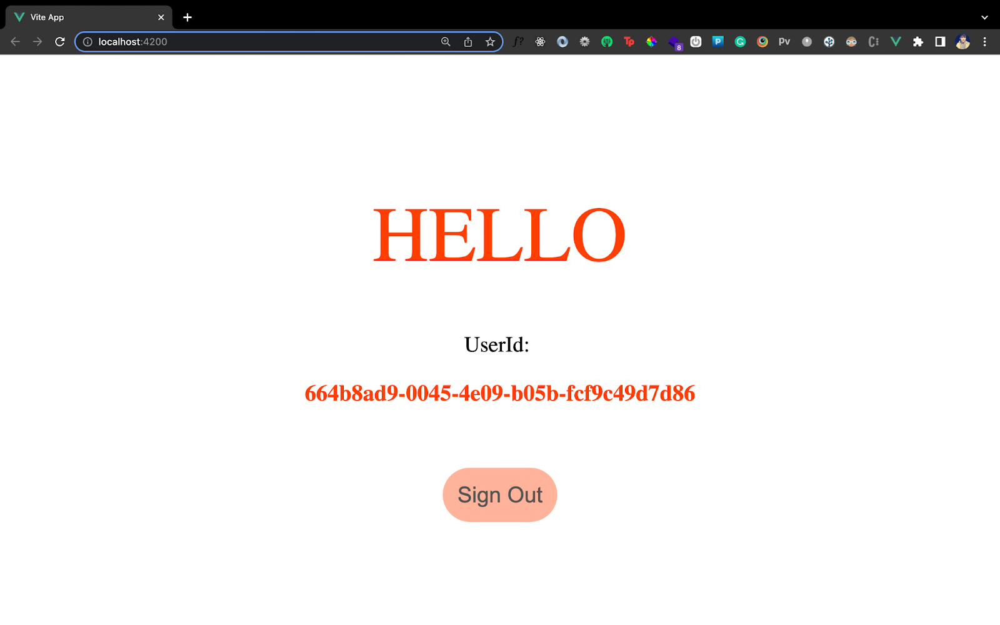

Building your own auth service can be tedious, complex and time-consuming. To save time, developers often resort to using third party auth services for auth. This post will guide you on how to add authentication to a VueJS app with SuperTokens. 

## What is SuperTokens?

[SuperTokens](https://supertokens.com) is an open source project which enables you to add auth to your app quickly. It gives you a pre-built auth UI and backend APIs for an end-to-end integration experience. 

Before we dive into the code, let’s discuss the overall architecture.

## Architecture

SuperTokens is built out of three components:
- Frontend SDK
- Backend SDK
- Core microservice that talks to a database.

We’ll use the SuperTokens frontend SDK in our Vue app to add all the auth forms (login, signup, reset password etc). You can also build your own UI using the helper functions from frontend SDKs, but we will focus on the pre built UI in this blog. 

The pre built UI are ReactJS components (provided by the [`supertokens-auth-react` library](https://github.com/supertokens/supertokens-auth-react)). In order to use them, we will have to render React components in our VueJS app.

For the backend, we will use the NodeJS SDK provided by SuperTokens ([`supertokens-node` library](https://github.com/supertokens/supertokens-node)). This SDK exposes all of the auth APIs (like `/auth/signin`, `/auth/signout` etc) via a middleware, for the frontend to call. When these APIs are called, the SDK will talk to the SuperTokens Core microservice to read and write information to the database.

The SuperTokens core service can be either self hosted (and connected to your own db), or be hosted by the team behind SuperTokens (sign up on [supertokens.com](https://supertokens.com)).

> In order to keep the app’s bundle size small, we will limit the use of the `supertokens-auth-react` SDK to all of the auth related routes (`/auth/*` by default), and use a lighter weight, vanilla JS SDK ([`supertokens-web-js` library](https://github.com/supertokens/supertokens-web-js)) for all other routes in our app. Finally, we will then use code splitting and lazy importing to make sure that the `supertokens-auth-react` SDK is only bundled when visiting the `/auth/*` routes.


## Frontend Integration

### 1. Setup and Install

Create a new Vue + Typescript app:

```shell
npm init vue@latest
```

In the prompt, select Typescript and Vue Router:



Once that’s done, head inside the project and install the following dependencies:

```shell
npm i cors express npm-run-all react supertokens-auth-react react-dom supertokens-node
```

The supertokens-auth-react library will be used on the frontend to render the login UI, and the supertokens-node library will be used on the backend to expose auth API routes that the frontend can call. 

### 2. Call the supertokens-auth-react and supertokens-web-js **```init```** function

The AuthView component will render the SuperTokens React component to handle authentication on the frontend. 
Create the ```AuthView``` component inside ```/src/views```:

```vue
<script lang="ts">


export default{

 

 }

</script>

<template>
 <main>
  </main>
</template>
```

Next we will create the SuperTokensReactComponent inside ```/src/components/Supertokens.tsx```. 

Inside this, we will initialize the supertokens-auth-react-SDK. This will tell SuperTokens which UI to show when the user visits the login page:

```typescript
import * as React from "react";
import * as SuperTokens from "supertokens-auth-react";

import * as ThirdPartyEmailPassword from "supertokens-auth-react/recipe/thirdpartyemailpassword";

import { Github, Google } from "supertokens-auth-react/recipe/thirdpartyemailpassword";
import Session from "supertokens-auth-react/recipe/session";

SuperTokens.init({
   appInfo: {
       appName: "SuperTokens Demo App",
       apiDomain: "http://localhost:3001",
       websiteDomain: "http://localhost:4200",
   },
   recipeList: [
       ThirdPartyEmailPassword.init({
           signInAndUpFeature: {
               providers: [Github.init(), Google.init()],
           },
           emailVerificationFeature: {
               mode: "REQUIRED",
           },
       }),
       Session.init(),
   ],
});

class SuperTokensReactComponent extends React.Component {
   override render() {
       if (SuperTokens.canHandleRoute()) {
           return SuperTokens.getRoutingComponent();
       }
       return "Route not found";
   }
}

export default SuperTokensReactComponent;
```

Next, we will load this **SuperTokensReactComponent** inside the **AuthView** component component:

```vue
<script lang="ts">
import * as React from "react";
import * as ReactDOM from "react-dom";
import SuperTokensReactComponent from "../components/Supertokens";

export default{

   mounted(){
      ReactDOM.render(React.createElement(SuperTokensReactComponent), document.getElementById('app'));

   },
   beforeDestroy(){
       ReactDOM.unmountComponentAtNode(document.getElementById('app') as Element);
   },

}

</script>

...
```

The above takes care of the auth related routes. For all the other pages in our app, we want to be able to know if a sessino exists and extract information from it. To do this, we will use the supertokens-web-js SDK. We initialize this SDK in our Vue app’s root file ```/src/main.ts```:

```typescript
import Vue from "vue";
import VueCompositionAPI, { createApp, h } from "@vue/composition-api";
import * as SuperTokens from "supertokens-web-js";
import * as Session from "supertokens-web-js/recipe/session";

import App from "./App.vue";
import router from "./router";

SuperTokens.init({
   appInfo: {
       appName: "SuperTokens Demo",
       apiDomain: "http://localhost:3001",
   },
   recipeList: [Session.init()],
});

Vue.use(VueCompositionAPI);

const app = createApp({
   router,
   render: () => h(App),
});

app.mount("#app");

```

Note that the config for Session.init call, the apiDomain and appName for both the init functions (supertokens-auth-react and supertokens-web-js) should always be the same.

### 3. Setup Routing to show the Login UI

Vue CLI already generates the initial routing for our app inside ```/src/router.index.ts ```file. We’ll update this file so that all ```/auth/*``` rotues load the ```AuthView``` component we created earlier:

```typescript
import Vue from 'vue'
import VueRouter from 'vue-router'
import HomeView from '../views/HomeView.vue'

Vue.use(VueRouter)

const router = new VueRouter({
 mode: 'history',
 base: import.meta.env.BASE_URL,
 routes: [
   {
   path:'/auth*',
   name:'auth',
   component: ()=> import('../views/AuthView.vue'),
  },
 ]
})

export default router
```

The path for the AuthView component is ```/auth*```. The asterisk indicates that any sub/nested paths with ```/auth``` as the parent path should be rendered by the ```AuthView``` component. 

We also lazy load the ```/auth``` route because the ```AuthView``` component loads some React related dependencies. Lazy loading makes sure that these dependencies are only injected in the ```AuthView``` component when you visit the ```/auth``` route. For all of the other routes, these dependencies are not imported thereby maintaining the overall bundle size of the application.

### 4. View the Login UI

If you now visit [http://localhost:4200/auth](http://localhost:3001/auth), you should see the Login UI as shown below:


### 5.Backend Setup

You can see the backend quick setup section [in our docs on supertokens.com](https://supertokens.com/docs/thirdpartyemailpassword/quick-setup/backend), or even copy the code from [our example app](https://github.com/supertokens/supertokens-auth-react/blob/master/examples/with-vue-thirdpartyemailpassword/server.ts). As a summary:

- You need to initialise the supertokens-node SDK and provide it the recipe list (similar to how you did on the frontend).
- Then you need to setup CORS, add the SuperTokens middleware and errorHandlers to your app. The SuperTokens middleware exposes all the auth related API routes (like sign in, sign up, signout etc) to the frontend.
- Finally, you need to provide the connectionURI (location) of the SuperTokens core. To get started quickly, you can provide it https://try.supertokens.com. This is a core that we host for demo purposes. 

Once you’ve successfully setup your server, you can now try and sign up on the frontend.

### 6. Managing Session

Inside ```/src/views/HomeView.vue``` file we’ll check if the user is authenticated and conditionally render a template. So for authenticated users, we can show them a logout button with information about their session like their userId. For unauthenticated users, we can show them a button to route to the ```/auth``` page. 

```vue
 <script lang="ts">
import * as Session from "supertokens-web-js/recipe/session";

export default {
   data() {
       return {
           session: false,
           userId: "",
       };
   },
   mounted() {
       this.getUserInfo();
   },
   methods: {
       redirectToLogin() {
           window.location.href = "/auth";
       },
       async getUserInfo() {
           this.session = await Session.doesSessionExist();
           if (this.session) {
               this.userId = await Session.getUserId();
           }
       },
       async onLogout() {
           await Session.signOut();
           window.location.reload();
       },
   },
};
</script>

<template>
   <main>
       
 		<div class="body">
           <h1>Hello</h1>

           <div v-if="session">
               <span>UserId:</span>
               <h3>{{ userId }}</h3>

               <button @click="onLogout">Sign Out</button>
           </div>
           <div v-else>
               <p>
                   Visit the <a href="https://supertokens.com">SuperTokens 											tutorial</a> to learn how to build Auth
                   under a day.
               </p>
               <button @click="redirectToLogin">Sign in</button>
           </div>
       </div>
   </main>
</template>
...
```

To load the `HomeView` component on ``/`` we’ll update the ```/src/router/index.ts``` file:

```typescript
...

const router = new VueRouter({
  ...
   routes: [
       {
           path: "/",
           name: "home",
           component: HomeView,
       },
      ...
   ],
});

export default router;
```

If you now visit http://localhost:4200, you should see the following page:



## SuperTokens Core Setup

Whilst doing the backend setup, we are using https://try.supertokens.com as the connectionURI for the core. This is a demo core instance hosted by the team of SuperTokens. You can use this for as long as you like, but when you are commited to using SuperTokens, you should switch to a [self hosted](https://supertokens.com/docs/thirdpartyemailpassword/quick-setup/core/with-docker) or a [managed version](https://supertokens.com/docs/thirdpartyemailpassword/quick-setup/core/saas-setup) of the core.

## Conclusion

To summarise, we used the React SDK provided by SuperTokens to show the pre-built login UI for our Vue app. We also optimised the bundle size so that the React SDK is only loaded for auth related routes.
Useful links:

- [Example Vue app](https://github.com/supertokens/supertokens-auth-react/tree/master/examples/with-vue-thirdpartyemailpassword)
- [Discord community (to ask questions)](https://supertokens.com/discord)
- [List of recipes / auth methods](https://supertokens.com/docs/guides)

