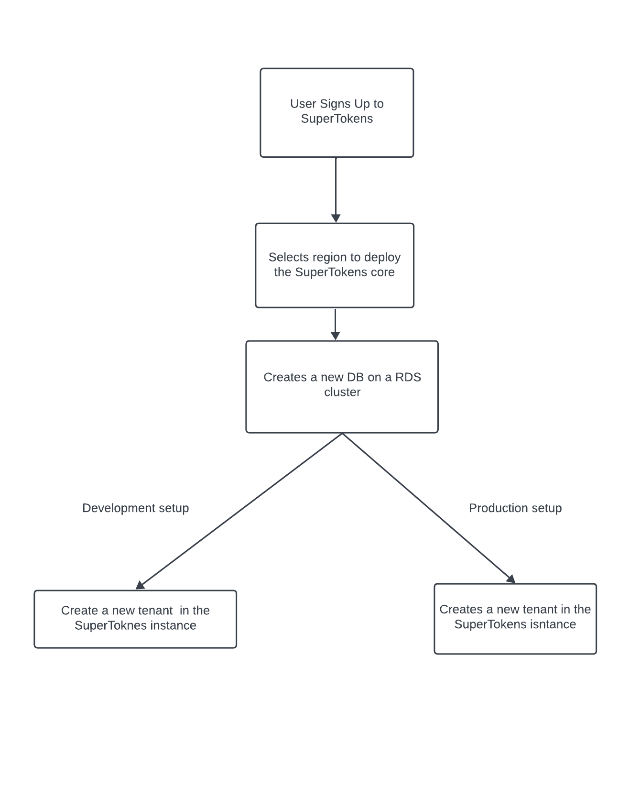
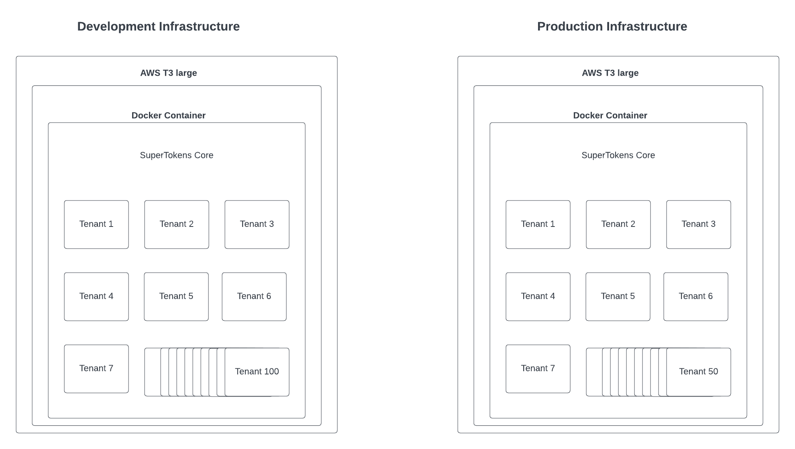

[**Part 1: How does the SuperTokens managed service work and why does it need to change.**](./how-we-cut-our-aws-costs/)

**Part 2: Using multi-tenancy to cut our AWS infra costs by by more than 50%**

In this part we will go over SuperTokens Multi-tenancy feature and how it evolved our deployment cycle to cut our AWS billing by 50%.

Here's what we covered in our [last post](./how-we-cut-our-aws-costs/):
- SuperTokens infrastructure and deployment cycle.
- Improvements made to the SuperTokens deployment cycle to speed up production deployment times by 30%
- How our infra costs were not sustainable and why it needed to change.

## What is multi-tenancy?

As mentioned in Part 1, "We saw multi-tenancy as an opportunity to optimize the utilization of our EC2 instances by consolidating our core instances. This would cut down our costs while also providing the expected performance"... But what does that mean? Lets break it down. Multi-tenancy is a feature, typically used by B2B SaaS companies to allow multiple organizations to sign up to their SaaS app, with the ability for each organization to have their own login methods or SSO configurations. Additionally, user pools can also be segmented. Heres how it helped us.

## How we implemented SuperTokens Multi-tenancy 

With multi-tenancy we re-architected the way we host and manage our users. Initially whenever a signed up and created an app with SuperTokens, it would trigger the following flow:

In this process each development and production SuperTokens core ran in their own separate EC2 instances. With Multi-tenancy we now treat all SuperTokens customers as tenants. This means that we could now host multiple users on a single SuperTokens instance. Our deployment process now looks like this:

As you can see in the new deployment strategy, when a new user signs up, we now create a new tenant in a SuperTokens instance. These instances run in `T3 large` instances. In our testing, for development mode, up to 100 tenants can be run seamlessly on a single instance and for production mode, up to 50 tenants can be created on single instance.

## What are the benefits of the new architecture?

### 1. Cost Savings

Well the biggest difference post this change is the cost savings.

Heres a bill for the month of July before the multi-tenancy changes kicked-in:

And heres the bill for September, post the changes going live

When compared, its **54%** down

### 2. Improved start up time

Another improvement was app startup time. In the new architecture, creating a new user is as simple as creating a new tenant. When compared to the old process, the new architecture is about 94% faster and new apps can be crated in seconds.

## Conclusion

Multi-tenancy with SuperTokens is a powerful feature that enables businesses to create unique authentication flows for their customers, segment users into unique user pools and automatically create new new tenants. For SuperTokens, multi-tenancy allowed us to consolidate our user applications to save on resources, but, your use case maybe very different. You can learn more about how multi-tenancy works and the experiences it enables by visiting the [multi-tenancy feature page](https://supertokens.com/features/multi-tenancy) 