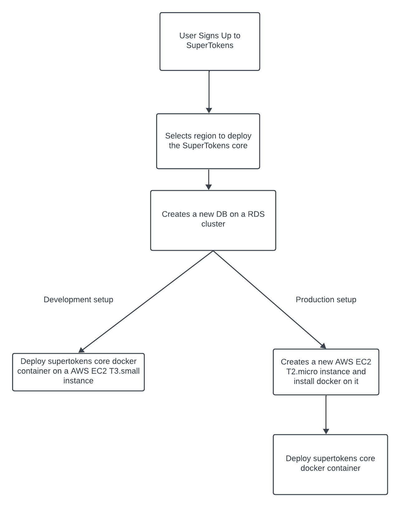

In this two part series we will go over SuperTokens manged service infrastructure and the changes we made to cut our AWS billing by more than 50%. 

**Part 1: How does the SuperTokens managed service work and why does it need to change.**

## Introduction

The SuperTokens managed service powers numerous web products, mobile applications, and services and is primarily hosted on AWS. Our infrastructure leverages a suite of AWS tools, including AWS RDS for our database, EC2 instances for SuperToken deployments, and System Manager for instance management and automation. Over time, we've refined our deployment cycle to enhance stability, fault tolerance, and cost efficiency but our most recent update has yielded our biggest savings yet, slashing costs by over 50% while achieving [record scalability](https://twitter.com/supertokensio/status/1701600309397852270). 

## What was the SuperTokens infrastructure like?

To gain a better understanding of the SuperTokens infrastructure, it's crucial to grasp the deployment cycle. 

SuperTokens allow users to use the SuperTokens SAAS service in two modes: development and production. Here’s the breakdown of each:

**Development Mode:**
The Development mode runs on an *EC2 T3.small* instance. To maximize resource utilization, we deploy up to seven development core instances on the same *T3.small* instance. This configuration results in a remarkably swift setup for new development cores, typically taking a mere 15-20 seconds and is suitable for testing purposes.

**Production mode:**
In contrast, production mode follows a different deployment strategy. Each production mode deployment is hosted on a dedicated *EC2 T2.micro* instance. This means that when a new production SuperTokens core instance needs to be created, a fresh *T2.micro* instance is spun up, and docker is installed on it using System Manager. Consequently, this process requires additional time compared to the development mode, with an average deployment time of around 4-5 minutes.

For example, if 7 users were to sign up for SuperTokens, it would look like the following:

### Initial Improvements to the deployment cycle

One of our initial optimizations focused on reducing the startup time for generating production instances. We recognized that creating a custom [AMI](https://docs.aws.amazon.com/AWSEC2/latest/UserGuide/AMIs.html)(Amazon Machine Image) pre-installed with Docker alongside the operating system that would cut down on start-up time. This change trimmed approximately 45 seconds from the production deployment procedure, reducing the setup time to approximately 3-4 minutes.

In retrospect, another avenue for improvement that we identified was the usage of [AWS Reserved Instances](https://aws.amazon.com/ec2/pricing/reserved-instances/). While this approach would have entailed an upfront cost, it would have resulted in substantial long-term savings.

So what prompted us to change our deployment process?

## Why we had to change our deployment process
The past year has been quite a ride for SuperTokens. We released a host of new features and saw a big uptick in users. But, as our user numbers climbed, so did our infrastructure costs. With our AWS credits running out soon, we knew we had to do something to cut our expenses.

With the release of our new multi-tenancy feature we saw it as an opportunity to optimize the utilization of our EC2 instances by consolidating our core instances. This would cut down our costs while also providing the expected performance.

In part 2 we will go over the changes we made to achieve this. 

