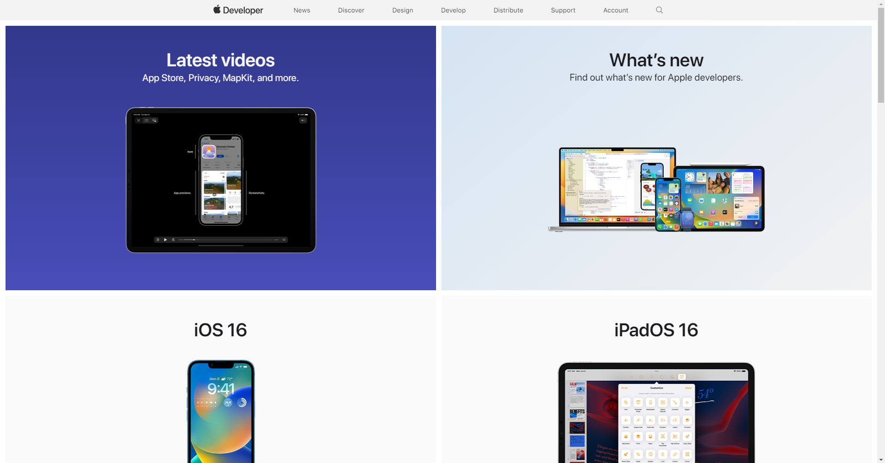
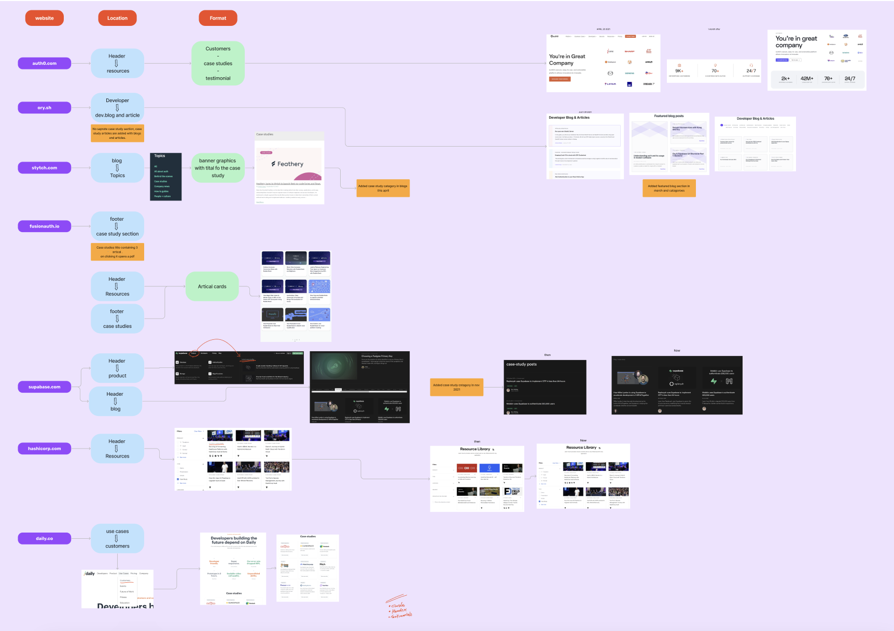
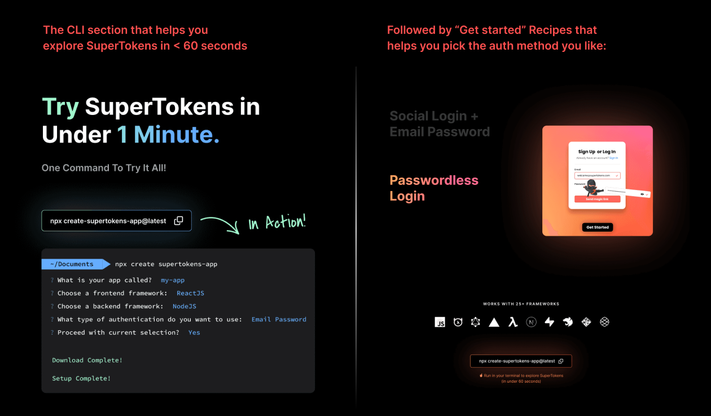
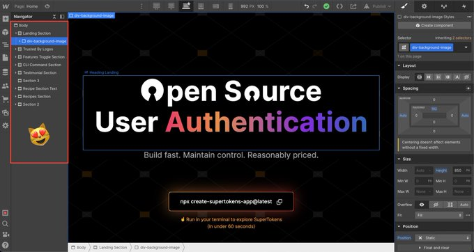
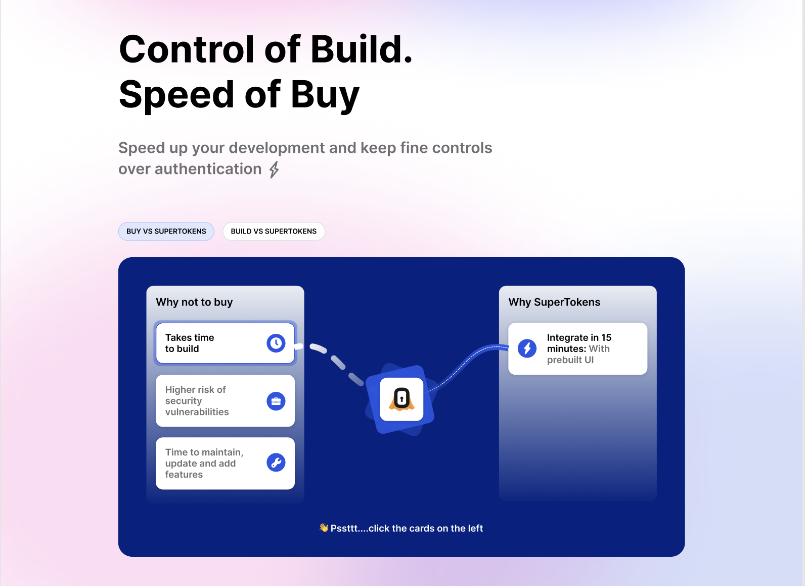
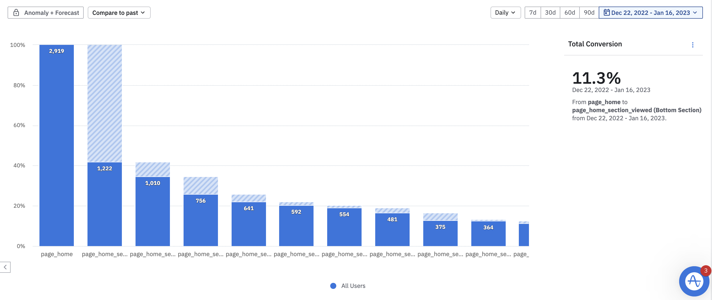

You may have noticed or heard from us that there’s something different about the SuperTokens website lately. Your eyes don’t deceive you, and the rumors are true.

We hope you’re enjoying the revamp as much as we are!

This is a short #buildinpublic piece on why we went for the redesign, our approach, and what we learned throughout the process.

## Why the Revamp?

There have been countless small changes since we first launched the SuperTokens site a few years back. As new features were released, we would add them in piecemeal - nothing was optimized for cleanliness or conversion.

We knew we wanted a more breathable, developer-friendly aesthetic that matched our brand and product.

Most importantly, the SuperTokens product had rapidly evolved, leaving the homepage stuck in the past. Since we first launched the site, we had shipped:

- User Roles
- 2FA
- SAML
- Microservice Auth
- Passwordless
- Account linking & multi-tenancy

We also needed to optimize our webpage to better accommodate the touchpoints in our user journey and gel better with our new CLI strategy.

## **The New SuperTokens Experience**

During discussions on how we wanted to improve in the new site, we realized that we didn’t really care about signups - the number of signups was a vanity metric.

What we really cared about was in our users getting familiar quickly, and interested users getting started quickly and easily, whether it was with self-hosted or our SaaS. Signing up would simply be one of the steps during implementation, not the end goal.

In the past, we had seen large drop-offs between users signing up and implementing SuperTokens because users would sign up without a clear path forward on how to ramp up.

This question became our north star - how do we make the journey to active usership as frictionless as possible?

We wanted to:

- Develop more trust in our users in their first impression
- Reduce cognitive load in our website copy
- Reduce the number of steps & friction necessary to try out SuperTokens
- Update our copy and documentation to reflect new features
- Place signup later in the user journey, with more guidance immediately after signup

With our CLI as the no-brainer way to get started with SuperTokens in less than a minute, our CTAs now guided users towards our documentation and our Discord community for questions and support.

The user journey before:

Sign up → docs → implement frontend → implement backend → implement core

And after:

Consult docs + join Discord → implement frontend → implement backend → sign up → implement core

## Our Approach

1. Research
2. Analyze Prior Data
3. Paper Layouts
4. Wireframes
5. Figma
6. Interview Users
7. Webflow

### Step 1: Research

Before starting anything, we wanted to make sure we based our design and layout decisions on empirical data and research.

*Success leaves clues - Jim Rohn*

To get an understanding for the evolution of design in the dev tool space, we used the Wayback Machine to look at how designs have changed over time.

Auth0’s homepage from 2020

Outside of the Wayback Machine, we looked at current homepages from other notable teams:

**Linear**

**Rudderstack**

**Stripe (duh, how could we not)**

**Apple Developers pages**

**Duffel**

**Airplane.dev**

**Supabase**

We learned from our Twitter and Reddit research that developer tools seemed to find success with gradients, dark themes, and minimalist design - all seem to be corroborated by the examples as well.

**Competitor Research**

We also used Figjam to map out what we thought our direct competitors did well (or didn’t). We drew inspiration for what types of content to include, and the order in which we should present it, for good flow on the homepage. 

### Step 2: Analyze Prior Data

Between our Discord and five to ten calls a week with prospective and active users, we were able to gather a lot of qualitative feedback on our existing site.

Plus, with consistent feedback from users along with data from Hotjar and Amplitude, we could identify specific areas of friction or confusion for our users.

Two spots in particular on our old site come to mind:

**1) The “We Are” section**

Our Hotjar recordings showed that people did not stick around to read it - it was just too much text.

**2) The “How It Works” section:**

Similar to the other section, there’s a lot going on. The ‘Back’ and ‘Next’ buttons at the top step the user through how SuperTokens works. What we found is that very few people clicked on the buttons at all, and only 0.5% percent of our visitors actually clicked all the way to the end.

Since it wasn’t doing what we wanted it to, we decided to nix this as well.

### Step 3: Paper Layouts

With our research and a good idea of what we wanted to say, we sketched out our different content sections of the homepage by hand. This proved to be a good way to get things brainstormed prior to designing in a digital medium. As you can tell, it was also easy to annotate and take notes for tweaks.

### Step 4: Wireframes

Based on our paper layouts, we created basic wireframes to start assembling everything digitally. This intermediate step allowed us to start playing with our ideas from the paper stage, without focusing too much on final polish too early.

### Step 5: Figma

After playing around with our basic wireframes, it was to design and assemble the flow of the webpage. We added in brand color and created polished versions of the wireframe components.

Then, when we were confident we had a couple of good design iterations, we kept dummy content the same while switching between different designs to see which ones worked better.

By using both content variation or design variation, we were able isolate which design and content would work best independently and then together.

### Step 6: User Interviews

Some screenshots of interviews with our users:

With the homepage built, it was time to see if we had indeed made the progress we wanted in the first place.

For authentic first impressions and unbiased feedback, we wanted to get users who were unfamiliar with SuperTokens. Thankfully, our post on Twitter was enough to get the ball rolling and we started interviewing!

In our conversations, we asked users to scroll through the homepage and narrate their thoughts aloud. Their thoughts were useful :

1. Anything that they mentioned was primary information - the important stuff. This let us know what was actually registering in our users’ minds.
2. Anything that they **didn’t** mention was classified as secondary information. Naturally we would ask ourselves and the interviewee: “Why was this secondary information?”
    1. Was it the content?
    2. Was the the UI?
    3. Both?

We incorporated the feedback by playing around - a lot - in Figma.

And here are some the final versions of the sections we tweaked based on user feedback!

### Step 7: Webflow

Once the design was done, it was time to implement everything in Webflow. While a lot of the custom JS took some time to get right, it was much easier to get everything designed and onto the page with Webflow instead of needing to flesh out individual components in React - which we knew more than likely we’d have to tweak and change over time anyway.

## We Learned a Lot!

Iterating through the website design with user interviews gave us a lot of surprises.

### Build vs Buy

There were two ideas that we wanted to communicate:

- Building your own auth is difficult and expensive, and buying auth is rigid and expensive
- With SuperTokens, you get the best of both worlds with none of the drawbacks, whether you choose a hosted or self-hosted plan.

However, those two ideas were too difficult to convey in one section of webpage and it was too confusing for our test users - so we removed it altogether.

### Logo Info

We learned that people liked the logos, but didn’t get a high amount of trust from them because they were unfamiliar with the companies. We added in description tags which would show on hover, which explained more about the logo.

Before:

After:

We got a lot of feedback that people **loved** the added context.

### Too Long!

80% of our interviewers thought the new homepage was too long! We took their feedback and shortened things up to include only the most important pieces.

### Confusion with Low Contrast

We saw users get confused on multiple occasions because of contrast.

For example, it was unclear to many that a new section of the page had started here:

Thankfully, this was an easy fix and in subsequent interviews this issue was no longer present.

### The Custom UI Section

This was a particularly interesting section to debug, because there were several aspects that needed changes.

Firstly, many users tried to interact with the login cards as if they were part of a horizontal carousel. When the cards didn’t behave in the way they expected, users felt confused.

To counteract this friction, we made the cards scroll horizontally automatically as the user scrolls down the page vertically - no input necessary.

Second, the “Hosted on [yourdomain.com](http://yourdomain.com), no more redirects!” was a crucial piece of text that we played around with to get right.

In prior conversations, we found that our users didn’t mention this piece of text or even notice it at all when asked about it later. After playing around with its position in the section, it started to be mentioned unprompted - success! Full ownership and no redirects is one of the biggest advantages to using SuperTokens, so it was important to us that users knew about it even with a casual glance.

Some users didn’t know that you could click on the tiles to actually see the live login pages - so we animated the cards on hover.

Here’s what the final version looks like:

### Webflow, Webflow, Webflow

After crunching some numbers, we estimate that implementing this new homepage would have taken us **3-4x longer** to implement with React.

There was no need to create custom components for one-offs that will inevitably change over time. That, and we could keep our engineering team focused on building good auth instead of dialing UI in by hand with React.

## Conclusion/Results

We had a lot of fun redesigning the homepage and we learned a lot about how to create a page that’s truly engaging to users.

Starting with research and keeping ourselves oriented with empirical data made sure the process was smooth and thorough.

We were touched to see our efforts get noticed:

Most importantly, our site was performing way better.

While we don’t have exact numbers on our exact performance on the prior homepage - it was clear that it was night and day.

Our visitors are engaged, with a lot less cognitive overload - 11% of our total visitors make it to the bottom of our homepage.

---

If you found this valuable, follow us for more build in public content, or check out our docs to get started using the easiest open source auth solution!