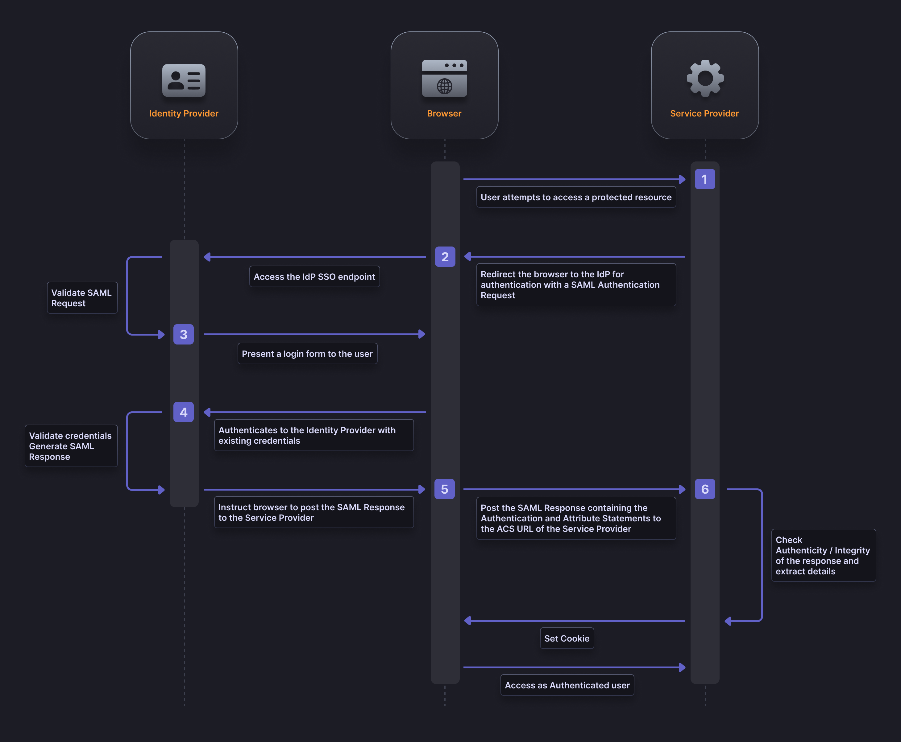
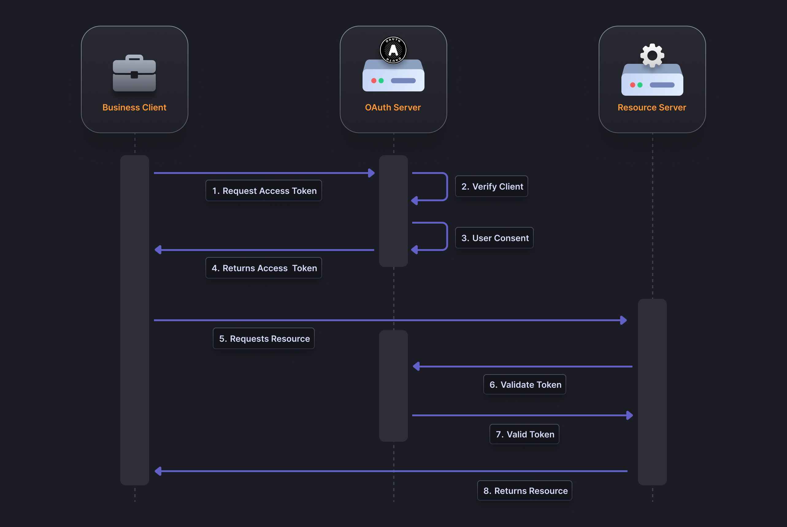

## Table of contents

- [Introduction](#introduction)
- [What is SAML and OAuth](#what-is-saml-and-oauth)
- [What are the use cases?](#what-are-the-use-cases)
- [Security and mechanisms](#security-and-mechanisms)
- [Conclusion](#conclusion)

## Introduction

SAML (Security Assertion Markup Language) at its core is an authentication protocol, used primarily by businesses to federate employee and customer access. For example, in a typical office environment when an employee logs into their work computer, they are using a SAML based authentication mechanism.

 OAuth (Open Authorization) on the other hand is an authorization protocol. It allows you to authorize a service to retrieve information from another service on your behalf without having to expose your credentials to the service. 
 An example of this is authorizing an application to pull your profile picture from your Google account without having to give your Google account credentials to the application.

## What is SAML?

SAML was established in the early 2000s and was designed to facilitate Single Sign-On (SSO) and federated identity management across multiple domains. SAML's focus lies primarily in enterprise environments, where seamless user authentication and trust relationships between systems are crucial.

When SAML authentication is complete the user has access to the suite of tools/applications used at a company. SAML allows the user to operate these resources through a single unified system. Additionally admins can use SAML to manage users from a central location.

What is OAuth?

OAuth, a comparatively younger protocol introduced around 2006, addresses the needs of authorization based on social accounts and API integration.

Its primary goal is to allow delegated authorization, allowing users to grant limited access to their resources to services without revealing their credentials. OAuth's widespread adoption stems from its ability to securely integrate with popular social platforms, such as Facebook, Twitter, and Google, and provide a standardized framework for granting access to user data through APIs.

## What are the similarities and differences between OAuth and SAML?

OAuth and SAML were created to establish standards of interoperability between applications. With both these protocols users can avoid a growing list of credentials that can block them from accessing important resources but are also be a major security concern.

As mentioned previously though, SAML and OAuth function very differently:

- SAML is an Authentication protocol, which involves the managing of a users identity.
- OAuth is an authorization protocol, which involves the handling of users privileges, delineating what resources  

## When Should You Use SAML or OAuth?

Although both SAML and OAuth allow for SSO like flows, that are imperative for employees, they are not exactly alternatives but protocols that can work together. For example, the [Microsoft environment](https://learn.microsoft.com/en-us/azure/active-directory/develop/authentication-vs-authorization) uses both SAML and OAuth to grant access and allow access to protected resources.

Although authentication and authorization are not a requirement for some applications, most businesses need some authentication and authorization system to function effectively.

## OpenID Connect(OIDC) and OAuth

As we have mentioned previously OAuth is primarily an Authorization protocol that traditionally uses , some business may want to allow users to use their social accounts as their identity. Thats where OIDC or OpenID connect comes in, it is a protocol built on top of OAuth, that allows for authentication. You can learn more about [OpenID Connect and how it is different from OAuth in our guide](https://supertokens.com/blog/oauth-vs-oidc).

## Conclusion

Authentication is ever-evolving, and it is essential to stay ahead of the latest developments and emerging protocols. Ultimately, the selection of SAML or OAuth depends on the specific requirements of the application or system. SAML is an established standard used by large businesses with complex authentication requirements while OAuth is comparatively newer, easier to use but aimed at authorization.

