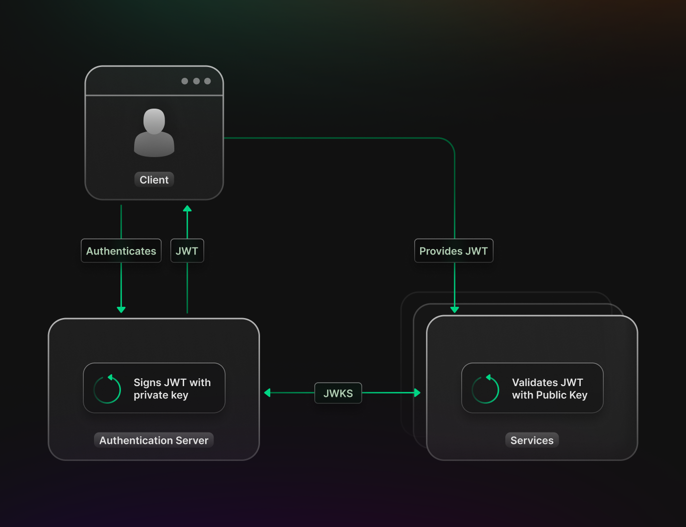

## Table of Content
- [Introduction](#introduction)
- [What are JSON Web Keys (JWKS)](#what-are-json-web-keys-jwks)
- [How do JWKS work?](#how-do-jwks-work)
- [Benefits of using JWKS](#benefits-of-using-jwks)
- [Considerations for JWKS implementation](#considerations-for-jwks-implementation)
- [Conclusion](#considerations-for-jwks-implementation)

## Introduction

JWTs or Json Web Tokens play a pivotal role in modern authentication. They are most commonly used to identify authenticated users and validate API requests. Part of this verification process requires the use of cryptographic keys to validate the integrity of the JWT to make sure it has not been tampered with. The set of keys used for this process is called JWKS or Json Web Key Set. In this blog post, we will go over what JWKS are and how they are used. If you are interested in learning more about JWTs and how they work, check out our [guide](https://supertokens.com/blog/what-is-jwt).


## What are JSON Web Keys (JWKs)?

JSON Web Keys (JWKs) are a JSON data structure that represents cryptographic keys. These keys are primarily used for verifying JWTs in OAuth flows. JWKs are designed to be easily exchanged, making them a standardized and interoperable format for representing cryptographic keys.

### Structure of the JWKS

A sample JWKS will have the following layout:

```json
{"jwk":
  [
    {
     "alg":"RSA",
     "mod": "0vx7agoebGcQSuuPiLJXZptN9nndrQmbXEps2aiAFbWhM78LhWx
4cbbfAAtVT86zwu1RK7aPFFxuhDR1L6tSoc_BJECPebWKRXjBZCiFV4n3oknjhMs
tn64tZ_2W-5JsGY4Hc5n9yBXArwl93lqt7_RN5w6Cf0h4QyQ5v-65YGjQR0_FDW2
QvzqY368QQMicAtaSqzs8KJZgnYb9c7d0zgdAZHzu6qMQvRL5hajrn1n91CbOpbI
SD08qNLyrdkt-bFTWhAI4vMQFh6WeZu0fM4lFd2NcRwr3XPksINHaQ-G_xBniIqb
w0Ls1jF44-csFCur-kEgU8awapJzKnqDKgw",
     "exp":"AQAB",
     "Kid":"2011-04-29"
    }
  ]
}
```

A JWK consists of a JWK Container Object, which is a JSON object that contains an array of JWK key objects as a member. The values of the JWK Container Object members can change depending on which algorithm is used. The example above contains a single member using the RSA algorithm and has the following members:

- **alg**: This member identifies the cryptographic algorithm used with the key. 
- **mod**: Contains the modulus value of the RSA public key. It is base64 encoded
- **exp**: exponent value for the RSA public key. It is base64 encoded
- **kid**: They Key id is used to match a specific key. During key rotation, the kid is used to choose among a set of keys within the JWK.

## How do JWKS work?

To make sure a JWT has not been tampered with we need to validate its integrity by verifying the signature. This requires a public key that corresponds to the private key used by the Authorization Server to initially sign the JWT. Typically the JWKS can be retrieved by querying an exposed by the Authorization Server known as a “jwks endpoint”. 



## Benefits of Using JWKS
- **Security**: JWKS enables the separation of concerns by centralizing key management. This segregation reduces the risk of exposing critical keys accidentally and is a much safer approach as opposed to having the keys hardcoded.
- **Scalability**: As web applications grow in complexity, managing cryptographic keys in a scalable manner becomes crucial. JWKS provides a standardized way to handle keys, simplifying key distribution and rotation as the application scales.
- **Interoperability**: JWKS is designed to be easily exchanged across different platforms and services. This interoperability fosters seamless integration between various components of the authentication ecosystem.

## Considerations for JWKS implementation:
For most users, you will be using an authentication provider and will not have to deal with setting up your Authorization Server, but, if you do decide to implement the flow yourself, here are some tips to ensure the security of your system in regard to JWKS:

- **Regular Key Rotation**: Frequently rotate the cryptographic keys represented in the JWKS to minimize the impact of potential key compromises.
- **Access Control**: Restrict access to the JWKS endpoint to only authorized clients and implement appropriate access control mechanisms.
- **Secure Key Storage**: Store the cryptographic keys securely, employing industry-standard practices like Hardware Security Modules (HSMs) or cloud-based Key Management Services (KMS).

## Conclusion

When it comes to authentication there are a number of terms and protocols thrown around which can be confusing when you first get started. We hope that through this article you have a better understanding of JWKS, its relevance to JWTs, and how they are used. If you have questions about the protocols that need JWKS, check our guides on [OAuth and OIDC](https://supertokens.com/blog/oauth-vs-oidc), they are protocols that use JWTs and rely on JWKS for verification.


