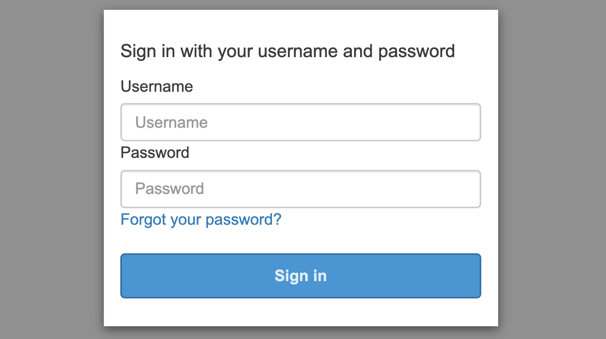
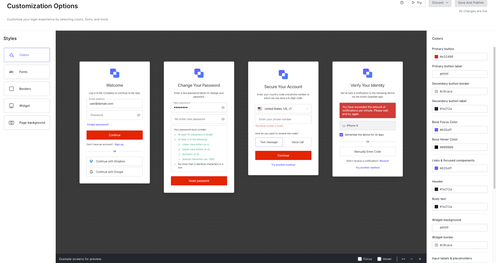

## Table of contents
- [Introduction](#introduction)
- [AWS Cognito Hosted UI](#aws-cognito-hosted-ui)
- [Auth0 Universal Login](#auth0-universal-login)
- [Firebase Authentication](#firebase-authentication)
- [Keycloak](#keycloak)
- [SuperTokens](#supertokens)

## Introduction

Authentication is an important part of every application’s user journey. A poorly made auth screen can be jarring or even discourage users from signing up. Let’s look at some pre-built UIs from current authentication providers and how to customize them.

|  	| Prebuilt Design 	| Customization possibilities 	| Customization Difficulty 	|
|---	|---	|---	|---	|
| AWS Cognito 	| Basic 	| Limited 	| Hard 	|
| Auth0 	| Good 	| Ample 	| Easy 	|
| Firebase 	| Basic 	| Limited 	| Hard 	|
| Keycloak 	| Basic 	| Ample 	| Hard 	|
| SuperTokens 	| Basic 	| Unlimited 	| Easy 	|

## AWS Cognito Hosted UI

With Cognito, the hosted UI is baked into their OAuth server and backed by the Cognito API. That means you’re either stuck with the default UI above or take the risk of misconfiguring settings when trying to make significant changes outside Cognito documentation.

Here’s a list of steps on how to change the UI from the AWS Management Console -

1. Sign in to your Amazon Cognito console
2. Navigate to User pools and click on the correct user pool
3. Select the App Integration tab
4. Click the “Edit” button on the Hosted UI customization section
5. Download the CSS template.css file under the Upload CSS customization header
6. Edit the CSS stylesheet based on Cognito docs
7. Upload the CSS stylesheet into the “Choose file” box and hit the “Save changes” button
8. To check on the customized UI, go to the following domain -https://<*your_domain*>/login?response_type=code&client_id=<*your_app_client_id*>&redirect_uri=<*your_callback_url*>
  - The domain is found on the App integration tab under the Domain section
  - The app client ID and callback URL can be found by clicking on the correct client name under the App clients name section at the bottom. From there, the Client ID is at the top while the callback URL is under the Hosted UI section.

Beyond this complicated chain of steps, each of the customization fields within the style sheet only support a very limited amount of change.

For starters, it’s impossible to change the font type on the entire page. You’re stuck with classic Arial for everything. In addition, the authentication UI is only available in English, with no support for any other language.

These frustrations are quite well documented in the following blog posts:
- [NEXT and Amazon Cognito](https://medium.com/collaborne-engineering/replace-cognito-hosted-ui-d7619d037036)
- [Properly and Amazon Cognito](https://inside.properly.ca/customizing-amazon-cognitos-hosted-ui-but-it-won-t-do-that-fd8a153a5f4a)
All in all, customization capability with Amazon Cognito’s pre-built UI is quite lacking.

## Auth0 Universal Login

At first glance, Auth0’s authentication design (Universal Login) looks pretty good. However, any serious customization effort can quickly become time intensive on the engineering side.
There are three ways to edit the UI behind Auth0’s Universal Login UI.

### 1. Using the no-code dashboard:
First and easiest is using the no-code dashboard provided by Auth0. Under the Branding navigation and Universal Login section is the Quick Start dashboard. In this dashboard, you can change the logo, primary button background color, and background color of the login page.

### 2. Universal Login Customization:
The second way is through the Universal Login Customization page, found below the Quick Start dashboard. Clicking into this page allows you to edit through all the authentication screens. You can customize the color for each element, change the font, and even change the positioning of third-party authentication buttons.

For those looking to go one step further, Auth0 also provides an Advanced Options page where you can override Universal Login with custom HTML. With custom HTML, you can change copy or tweak the positioning of each login element. You can also choose between the New Universal Login with no-code customization options or the Classic Universal Login that has more custom UI support.

### 3. Universal Login page updates through the Management API

The third and final option is to update the Universal Login page templates using the Management API. Editing the page template is the only way to add images, footers, and change the layout of the authentication pages. Once you’ve set up the page template, uploading it requires making a PUT request using your Management API token and the template code in the payload. The template is then applied to all authentication screens. In essence, all pages will have the same design.

Thankfully, their CLI tool alleviates some issues around editing the Universal Login page template. While it’s still an experimental release, the tool allows you to preview changes through Storybook. This makes it much easier to develop, but committing changes still requires making a PUT request.

Auth0 has [extensive documentation](https://auth0.com/docs/customize) on customizing their login page. However, the issue we’ve run into is that documentation ≠ ease of use. It still takes hours of work to make even a basic login screen that matches the rest of your website.

## Firebase Authentication

Firebase is a popular auth provider that specializes in mobile authentication.

Their pre-built UI offers little room for widget customization. The squarish buttons within the sign in widget are set in stone. The only customizations possible are the theme of the background or small edits such as changing the [button font size](https://github.com/firebase/firebaseui-web/issues/595).

You can find more details about customization and configuration in [their web UI documentation](https://github.com/firebase/firebaseui-web/blob/master/README.md#customizing-firebaseui-for-authentication).

Some users have taken it upon themselves to build [custom solutions](https://github.com/firebase/FirebaseUI-Android/issues/229#issuecomment-236868365) to override the default UI. However, many of these solutions are [outdated](https://github.com/firebase/FirebaseUI-Android/issues/1477).

Another path that we’ve seen users take is implementing custom UI components which utilize the Firebase SDKs for authentication. Rather than being stuck with Firebase’s pre-built UI, users can build their own UI and call Firebase auth methods through the Firebase Auth SDK. 

For more information, see the [Firebase documentation](https://firebase.google.com/docs/build).

## Keycloak

Keycloak is an open-source authentication provider.

Unfortunately, following their documentation on customizing their default UI (known as themes) can be quite the challenge.

To configure Keycloak’s UI, you’ll need to -

1. Create a new theme based on Keycloak documentation
2. Add a custom stylesheet in the css folder
3. Link the new stylesheet to the theme through the style property in theme.properties
4. Start Keycloak and sign in to the admin console
5. On the admin console, navigate to the Realm Settings
6. Click on the Themes tab and select appropriate themes

Keycloak suggests building a custom theme by extending their base theme (HTML templates + message bundles) or a Keycloak theme (containing images and stylesheets). With either option, you’ll need to override existing elements and create custom attributes.

Overall, the customization process for Keycloak is clunky and needs some elbow grease to get it pixel perfect.

## SuperTokens

SuperTokens is another open-source authentication provider. We support multiple authentication strategies, including: 
- [Passwordless](https://supertokens.com/docs/passwordless/introduction)
- [Social Login](https://supertokens.com/docs/thirdparty/introduction)
- [Email Password Login](https://supertokens.com/docs/emailpassword/introduction)
- [Phone Password Login](https://supertokens.com/docs/phonepassword/introduction)
- [Passwordless + Social Login](https://supertokens.com/docs/thirdpartypasswordless/introduction)
- [Email Password + Social Login](https://supertokens.com/docs/thirdpartyemailpassword/introduction)
- [Session Management](https://supertokens.com/docs/session/introduction)

We provide a pre-built authentication package, including login, password, and password reset screens. These screens can be easily edited through changing the CSS attached with each element or using the [React component override feature](https://supertokens.com/docs/thirdpartyemailpassword/advanced-customizations/react-component-override/about).

All of these improvements allow you to minimize time spent on optimizing authentication UIs and instead focus engineering time on product. 

For more advanced users, we’ve introduced custom UI where you can call any authentication feature from a function level. This means that you can build your user authentication flow into any point of your user experience. Or, use your own login password template without having to spend extra engineering time. Function level abstraction means you have complete control over your design, with no need to learn third-party documentation.
