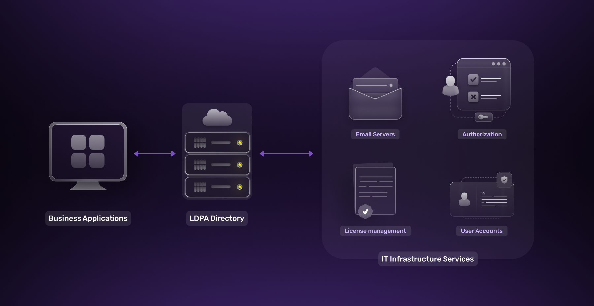

## What is LDAP?

The Lightweight Directory Access Protocol (LDAP) is an open, vendor-neutral, industry-standard protocol used to look up information about users from a directory service in a network.

Directory services are repositories that maintain information about users and resources. They essentially act as identity stores that house usernames, passwords, permissions, information about devices, and more. Although directory services may use additional protocols like OAuth or SAML, most still use LDAP today.

LDAP enables the secure management of IT resources in a directory, making it possible to control access to different parts of a network.

### How does LDAP work?

In the workplace, the average employee can interact with LDAP multiple times a day. Before they can start performing search operations, they will need to authenticate themselves. This can be done in two methods:

- **Simple**: A correct username and password will authenticate the user with the server.
- **Simple Authentication and Security Layer (SASL)**: A secondary service, like Kerberos is part of the authentication process before the user can connect. This is ideal for companies that need additional security.

Although LDAP search operations can be quite complex, we can break down the process of requesting resources from the LDAP server into 4 steps:

- **Session** connection: The user connects to the server via an LDAP port.
- **Request**: The user submits a query to the server. (This could be an email lookup)
- **Response**: The LDAP protocol requires the dictionary and delivers it to the user.
- **Completion**: The user disconnects from the LDAP port.

There are a number of operations that can be performed with LDAP:
- **Add**: Add a new user/device to the database
- **Delete**: Remove a file from the database
- **Search**: Start a search query to perform a lookup within the database
- **Compare**: Find similarities or differences between files in the database
- **Modify**: Update the contents of an existing entry.

## LDAP vs Active Directory

LDAP and Active Directory are sometimes used synonymously which can cause some confusion. Although they work together, they are very different.

Active Directory is a directory service created by Microsoft used to organize user information and devices like computers and printers. 

LDAP as mentioned previously is a protocol that works with directory services like Active Directory to query information. but is vendor-neutral, which means that it can work with all kinds of products like Okta Workforce Identity or AWS Directory Service.

## Conclusion
In the world of workforce identity and B2B authentication, LDAP plays a pivotal role in managing IT resources. As an open standard protocol, it is compatible with most directory services and is environment-agnostic including Windows and Unix-based systems.

